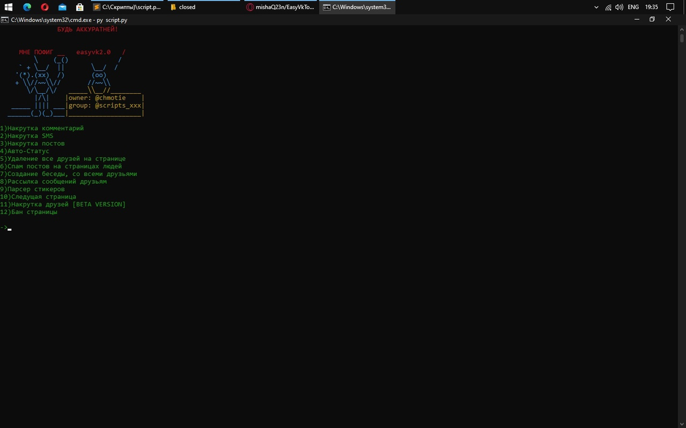

# EasyVkTools. Утили, где собраны много инструментов для ВКонтакте 

Подробнее ...

Список возможностей скрипта.
1)Накрутка комментарий
2)Накрутка SMS
3)Накрутка постов
4)Авто-Статус
5)Удаление все друзей на странице
6)Спам постов на страницах людей
7)Создание беседы, со всеми друзьями
8)Рассылка сообщений друзьям
9)Парсер стикеров
10)Следущая cтраница
11)Накрутка друзей [BETA VERSION]
12)Бан страницы 

# Инструкция, для TERMUX
**pkg update && pkg upgrade**
---
**pkg install git**
---
**pkg install python**
---
**git clone https://github.com/mishaQ23n//EasyVkTools**
---
**cd EasyVkTools**
---
**python script.py**
